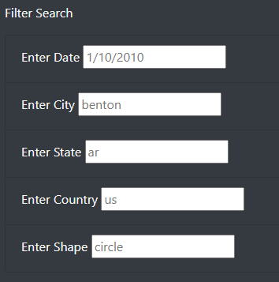

# UFO Analysis

## **Overview of the UFO Analysis**: In this challenge, we were asked to update the html page we created during the module to allow users to apply more filters to the table. In addition to being able to filter the table by date, we were asked to add filters for city, state, country and shape of the UFO sighting, which could all be applied simulateously.

### We first started by adding new list elements to our index.html file. Just like we had a list tag for the date, we created 4 new list tags: one for city, one for state, one for country and one for shape. Each list tag had a placeholder added in their respective search box. 

### Secondly, we removed the list element that created the button in the html code, since we updated our event listener so that it would detect a "change" on each input element and called the updateFilters() function instead of having the user click on a search button. This also allowed us to keep the page clean and more automated.

### Lastly, we updated our app.js code to:
1. Create an empty filters variable to keep track of the additional elements that would change when a search is performed
2. Update our handleClick() function to an updateFilters() function
3. Loop through the filters object and store the data that matches the filter values
4. Rebuild the table using the selected filters.

## **Results**: 

### Any user landing on our HTML page would see the table filled with all the information available in our data.js file. On the left hand side, they would see that there are now 5 search boxes, with placeholders information in there. 

#### To use the updated filters, users could enter any data they would like to filter in one of the search boxes, or in all of them, and the table would automatically update with the selected filters thanks to our updateFilters() function. For instance, a search for a UFO sighting in Spring Valley would lead to the below table:

#### However, users could decide to use multiple filters at once. For instance, a search for a UFO sighting on 1/7/10 in the shape of a light would lead to the below table:

!Filter Example 2](Analysis/FilterMultipleSearch.png)

#### Lastly, removing the text in the search boxes would re-populate the table with all data available in the data.js file.

## **Analysis Summary**:

### One drawback to this design is that when users select filters that are too restrictive, the table becomes empty. 

1. Our first recommendation is to provide an automatic message that would tell users to remove some of the filters when there is no data in the table.
2. Our second recommendation is to create column filters inside the table itself, so that users could sort each column of data. For instance, that could sort each table row by shape, or by duration. 

!Filter Example 3](Analysis/FilterEmpty.png)